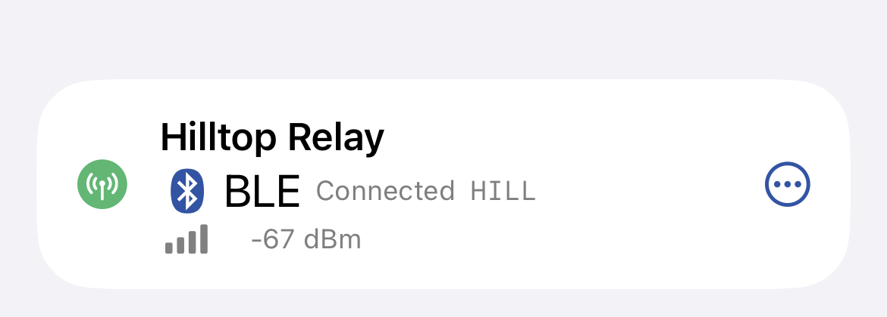
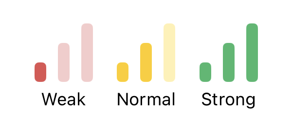
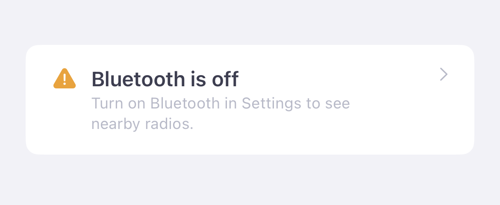

# Bluetooth Device Connection

The Meshtastic app connects to your radio over Bluetooth Low Energy (BLE). You can keep up to four radios connected at once and switch which one is focused without re-pairing.

## Connecting a Radio

1. Power on your Meshtastic radio.
2. Open the app and tap the **Connect** tab.
3. The app scans for nearby devices automatically when you are not connected.
4. Tap your device name in the list to connect.

The app remembers your preferred device and reconnects automatically when the radio is in range.

## Disconnecting a Radio

Swipe left on a connected radio in the Connect view and tap **Disconnect**. The radio continues operating on the mesh — it just stops syncing with the app.

With other radios connected, one of them becomes the focused radio, and the radio you disconnected isn't reconnected automatically.

## Powering Off a Radio

Long press a connected radio row and choose **Power Off** to shut the radio down completely. Unlike **Disconnect** — which only stops the app from syncing — Power Off turns the radio off entirely, and you must physically power it back on to use it again.

Because that is hard to undo on a roof, tower, or other remote node, the app asks you to confirm before sending the shutdown, so an accidental tap (or a misplaced finger) won't power the device off.

## Live Activity

Long press a connected radio row to start a Live Activity (iOS 16.2+). The Live Activity shows mesh status on your Lock Screen and in Dynamic Island.

## Managing Multiple Radios

You can connect up to four radios at once, over Bluetooth, TCP, or serial in any mix. All of them share one database: every message, node, and position they hear is stored once, and the app remembers which radio heard what.

One connected radio is the **focused** radio. It is the one shown at the top of the Connect tab, and the one whose settings you see and change. Messages go through the focused radio too, unless you pick another radio with **Via** in a conversation (see [Messages](messages.md)). With **Share Location** on, every connected radio gets your phone's position, and each radio with MQTT **Proxy to Client** on gets its own MQTT connection (see [MQTT](mqtt.md)). The other connected radios keep receiving in the background and are listed under **Also Connected**, with their battery, Bluetooth signal and unread direct messages.

Radios connect one at a time: while one downloads its settings and node list, another waits its turn, so connecting several at once takes a little longer than one.

### Adding a Radio

While a radio is connected, the Connect tab lists nearby radios under **Add a Radio**. Tap one to connect it. The app asks what you want to do:

- **Keep [radio] and Add [new radio]** connects the new radio and keeps the current one.
- **Switch to [new radio]** disconnects the focused radio and connects the new one in its place. Nothing is deleted.

To stop the question, choose a default in **Settings › App Settings › Connecting Another Radio**: Ask Each Time, Keep Both Connected, or Switch Radios. With four radios connected, only switching is offered.

> **Tip — Focus another radio**
> In **Also Connected**, tap the **⋯** button next to a radio and choose **Focus This Radio** to make it the focused radio. Nothing disconnects: the previously focused radio moves to **Also Connected**, and both keep receiving. Choose **Disconnect** to disconnect only that radio.

With more than one radio connected, the radio indicator at the top of each screen shows **+1**, **+2** or **+3** for the other radios. Tap it to see them all and focus a different one from anywhere in the app.

Some radios need you before they can be used, whether they're focused or not. They stay connected, and the app asks about them by name:

- **A locked radio** (lock-down firmware) needs its passphrase. A radio with a passphrase the app has saved is unlocked on its own. Otherwise the app says the radio is locked; **Unlock** focuses it and shows the passphrase sheet. Its row under **Also Connected** says **Locked** until then.
- **A radio on firmware the app no longer supports** needs an update. **Update** focuses it and shows the firmware update screen. Its row says **Needs a firmware update** until then.

With more than one radio connected, the passphrase sheet and the update screen show the name of the radio they're for.

### Reconnecting

A radio connected alongside the focused one is remembered. If it drops out of range or restarts, the app keeps trying to reconnect it, backing off to once a minute. The next time the focused radio connects — for example when you open the app — the remembered radios are connected again too. Choosing **Disconnect** on a radio stops this until you connect it again yourself.

If iOS closes the app in the background while Bluetooth radios are connected, it relaunches the app when one of them has something to send. Your usual radio is restored as the focused one and the others rejoin under **Also Connected**. A radio the app doesn't bring back within a few minutes is let go, so it's free for another connection.

If the focused radio drops and doesn't come back within about 30 seconds, another connected radio becomes the focused one without reconnecting, and the dropped radio rejoins under **Also Connected** when it's back. Likewise, if your usual radio isn't around when you open the app, a remembered radio that's in range is connected after about 30 seconds, and your usual radio joins when it appears.

### Switching Radios

Switching to a radio that isn't connected yet disconnects the focused radio and connects the new one; switching to one that's already connected only moves the focus. The database stays as it is, so the previous radio's messages and nodes remain in the app. After the new radio finishes its initial config handshake, the app first reapplies the bundled Meshtastic hardware catalog that ships with the app, then refreshes the same catalog from the Meshtastic API in the background so hardware names, images, and firmware-target metadata stay current.

> **Warning — Restoring a backup**
> Restoring a backup from **Settings › Backups** replaces the whole database, so the app disconnects any radios connected alongside the focused one first.

Earlier versions kept each radio's messages and nodes in a separate backup and swapped them in when you switched radios. The first time you open this version, those backups are merged into the one database, so every radio's history is there at once. Anything already in the database is kept as it is; only messages, nodes and history it doesn't have are added. A backup of a radio the database already holds isn't merged, so messages you deleted don't come back. The backup files themselves aren't changed or deleted.

## BLE Signal Strength

The app displays the Bluetooth signal strength of nearby devices during scanning:

## Connection Status Icons

| Icon | Meaning |
|------|---------|
|  | Connected via BLE |
|  | Reconnecting / retrying |
|  | Connected via TCP/IP |
|  | Connected via serial (macOS) |

## Troubleshooting

**Radio not appearing in the list**
- Ensure Bluetooth is enabled in iOS Settings → Bluetooth. If Bluetooth is off, the Connect tab's Available Radios section shows a "Bluetooth is off" row — tap it to jump straight to Settings.

  
- Move within 10 meters of the radio.
- Restart the radio.
- The app continuously listens for BLE advertisements — nearby radios should appear within a few seconds. If a device disappears from the list, it will reappear automatically when next heard.

**Connection drops repeatedly**
- Check battery level on the radio.
- Try forgetting the device in iOS Settings → Bluetooth and reconnecting.

**App asks for Bluetooth permission**
- Grant permission in iOS Settings → Privacy & Security → Bluetooth → Meshtastic.

---

{: .tip }
> **Tip — Connected Radio**
> Swipe left to disconnect. Long press to start the Live Activity or to power off the radio (you'll be asked to confirm).
