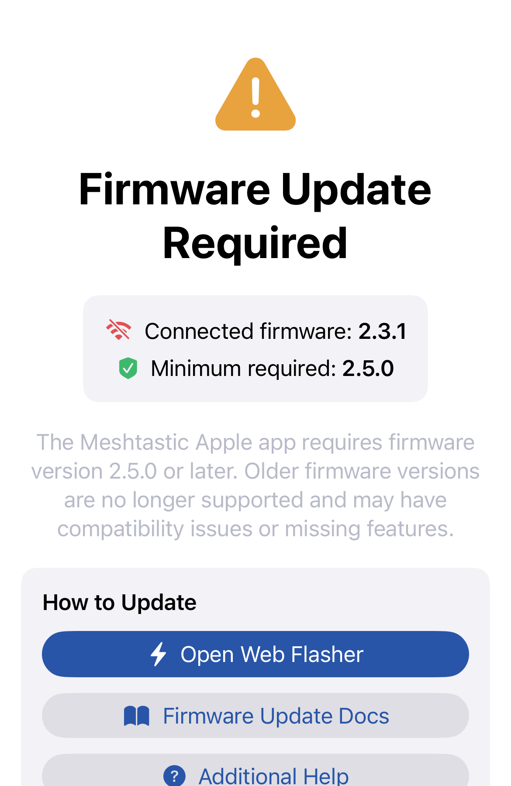
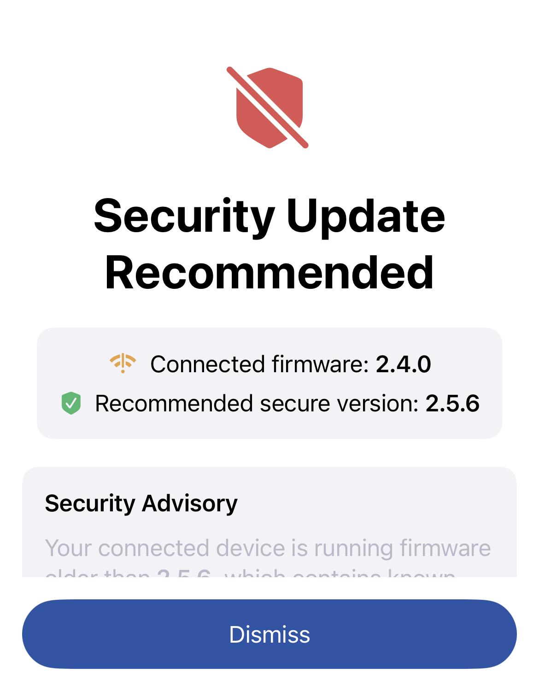

# Firmware Updates

The app can check for and install Meshtastic firmware updates directly on your connected radio over Bluetooth.

## Checking for Updates

1. Connect to your radio.
2. Go to **Settings → Firmware Updates**.
3. The app shows the firmware version currently running on your radio and the latest stable release available from GitHub.

When you connect to a node running firmware older than the latest stable release, the app can send a firmware update notification. For hardware the app can update directly, tapping the notification opens **Firmware Updates** so you can review and start the OTA update. For hardware that needs an external updater, the notification tells you to use **Meshtastic Flasher** instead.

The app remembers each node, hardware target, and stable version it has already notified you about, so it will not keep sending the same reminder.

Some radios report a specialized firmware target that is not a separate entry in the hardware catalog. In that case, the app uses the base hardware entry for details such as the device name and processor architecture, but it keeps the radio's exact target when choosing downloads and local files. The suggested filename on the Firmware Updates screen uses that exact target, such as `firmware-thinknode_m1-inkhud-<version>.uf2`.

## Installing an Update

1. Tap **Update Firmware** when a newer version is available.
2. The app downloads the correct firmware binary for your hardware.
3. The radio enters update mode (DFU) and the new firmware is transferred over BLE.
4. The radio reboots automatically when the update completes.

For ESP32 BLE updates, the app waits for the radio's final verification response before showing success. If the radio reports an error or does not send the final success response, the app keeps the update in a failed state instead of treating the upload as complete.

| Icon | Progress | Description |
|------|----------|-------------|
|  | Starting | Update initiating — firmware binary downloading. |
|  | In Progress | Firmware transfer in progress over BLE. |
|  | Complete | Transfer finished — radio is rebooting. |
|  | Error | Update failed — see Troubleshooting below. |

**Do not close the app or move out of Bluetooth range during a firmware update.**

## nRF52 Firmware Maintenance

Supported nRF52 UF2 releases have a **Firmware Maintenance** menu in **Settings → Firmware Updates**.

- **Upgrade Bootloader** installs the OTAFIX bootloader for the mounted radio, then requires a second UF2 pass to reinstall the selected application firmware.
- **Erase and Reinstall** performs a flash-level factory erase, then requires the same application reinstall. It permanently removes the radio's owner, channels, identity keys, settings, and node database.

Both actions use the mounted bootloader volume in Files. Enter DFU mode, choose the volume for the maintenance pass, then enter DFU again and choose the freshly mounted volume for the application reinstall. Do not repeat a pass if Files reports that it could not save the UF2 file or the volume ejects. Reconnect the radio and verify the firmware before completing recovery.

## During the Transfer

While a supported OTA transfer is active, the update screen rotates short tips, and you can tap **Play Chirpy Hop** to play without leaving the updater. Firmware progress remains visible above the game, and the back button returns to the normal update screen at any time. Keep the Meshtastic app in the foreground until the update finishes.

## Update Channels

| Channel | Description |
|---------|-------------|
| Stable | Recommended for most users. Tested releases. |
| Alpha | Early access — may contain bugs. Use on secondary/test devices only. |

Select the update channel in **Settings → App Settings → Firmware Channel**.

## Event Firmware

Some radios ship with special **event firmware** for gatherings like DEF CON, FAB, Open Sauce, Hamvention, or Burning Man. When you connect to a device running event firmware, the Meshtastic logo in the navigation bar changes to the event artwork. The Connect screen also shows the event's human-readable name in the firmware section.

Tap the event artwork to open the **event info sheet**, which shows the event's location, dates, useful links, and event firmware version. **Use Event Theme** applies event highlight colors to interactive controls and event fonts inside this dedicated surface. Standard navigation backgrounds remain unchanged.

If new-node notifications are enabled, the app temporarily mutes them while you're connected to event firmware (events are busy — many nodes appear at once). It restores them when you return to standard firmware. A notification preference you had already turned off stays off.

Event details are fetched from Meshtastic's servers with a persistent offline fallback, so a newly announced event can appear without an app update. Hosted artwork and links are restricted to HTTPS, and invalid content falls back to bundled artwork or the standard Meshtastic logo.

The metadata feed is informational. The app does not download or install firmware packages from event metadata; updates continue to use the app's verified firmware workflow.

## Troubleshooting

**Update fails mid-way**
- Keep the radio within 1–2 meters of your phone during the update.
- If the radio appears bricked after a failed update, it can usually be recovered using the [Meshtastic Flasher](https://flasher.meshtastic.org/) on a computer.

**Radio not appearing in firmware list**
- The firmware update feature requires a connected radio (BLE or TCP).
- Some older radios do not support OTA updates. Check the [hardware compatibility list](https://meshtastic.org/docs/hardware/).

**Version shown as unknown**
- Ensure the radio has fully connected and synced (usually takes 5–10 seconds after BLE connection is established).
