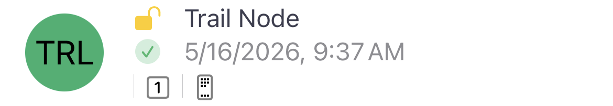

# Nodes List

The Nodes tab shows every device your radio has heard on the mesh. Tap any node for details.

## Node Status

| Element | Meaning |
|---------|---------|
| Coloured circle with initials/emoji | **Short Name & Long Name** — each node has a short name (up to 4 bytes) shown in the coloured circle and a long name displayed next to it. The circle colour is derived from the node number. The short name can be an emoji or initials. |
| ✅ Green checkmark | **Online** — the node has been heard recently and is considered online. |
| 🌙 Orange moon | **Idle / Sleeping** — the node has not been heard from recently and may be asleep or out of range. |
| 🐇 Hops icon | **Hops Away** — the number of intermediate nodes relaying messages between you and this node. No hops means direct communication. |

## Encryption

| Icon | Meaning |
|------|---------|
| 🔓 Yellow lock | **Shared Key** — direct messages are using the shared key for the channel. |
| 🔒 Green lock | **Public Key Encryption** — direct messages use public key infrastructure. Requires firmware 2.5+. |
| 🗝️ Red slash key | **Public Key Mismatch** — public key does not match the previously recorded key. Verify the contact out-of-band. |

## Device Roles

Each node is configured with a role that determines how it behaves on the mesh. Roles are shown in the node detail view.

| Role | Description |
|------|-------------|
| Client | Standard end-user device. Sends and receives messages, shares position. |
| Client Mute | Like Client but does not rebroadcast packets. Reduces mesh traffic near congested areas. |
| Router | Dedicated router — prioritises packet forwarding. Do not run other apps on router nodes. |
| Router Client | Combined router and client. Forwards packets and allows normal use. |
| Repeater | Repeats all packets without filtering. Use for range extension only. |
| Tracker | Optimised for position reporting. Sends frequent GPS updates, minimal messaging. |
| Sensor | Optimised for telemetry. Sends sensor data frequently, minimal messaging. |
| TAK | Used with TAK/ATAK integration. Sends CoT position reports. |
| TAK Tracker | Lightweight TAK role for position-only devices. |
| Lost and Found | Reports position infrequently. Useful for asset tracking. |
| Gateway | Acts as a bridge to MQTT or internet. |

[Choosing the Right Device Role →](https://meshtastic.org/blog/choosing-the-right-device-role/)

## Compact Node Row Examples

## Logs (Node Detail View)

Tap a node and scroll to the Logs section for detailed metrics:

| Log | Description |
|-----|-------------|
| 📍 Distance & Bearing | Direction and distance to the node based on GPS. Requires both devices to share location. |
| **2** Channel circle | The numbered circle shows which channel the node uses. Only shown for secondary channels (not primary channel 0). |
| 📶 Signal: Good | SNR is above the modem preset limit — strong, reliable signal. |
| 📶 Signal: Fair | SNR is slightly below the modem preset limit — connection may be intermittent. |
| 📶 Signal: Bad | SNR is well below the modem preset limit — expect packet loss. |
| 📶 Signal: Very Bad | SNR is far below the modem preset limit — communication unlikely. |
| Gradient meter | Signal strength bar (red → orange → yellow → green) combining SNR and RSSI relative to modem preset. |
| 📱 Device Metrics | Battery level, voltage, channel utilisation, and airtime reported by the node. |
| 📍 Positions | GPS position data including latitude, longitude, and altitude. |
| 🌤️ Environment | Sensor data: temperature, humidity, barometric pressure. |
| 🔍 Detection Sensor | Motion or door open/close alerts from the node. |
| 🛤️ Trace Routes | Recorded trace route paths showing the hops a message took through the mesh. |

[Device Configuration Docs →](https://meshtastic.org/docs/configuration/radio/device/)
