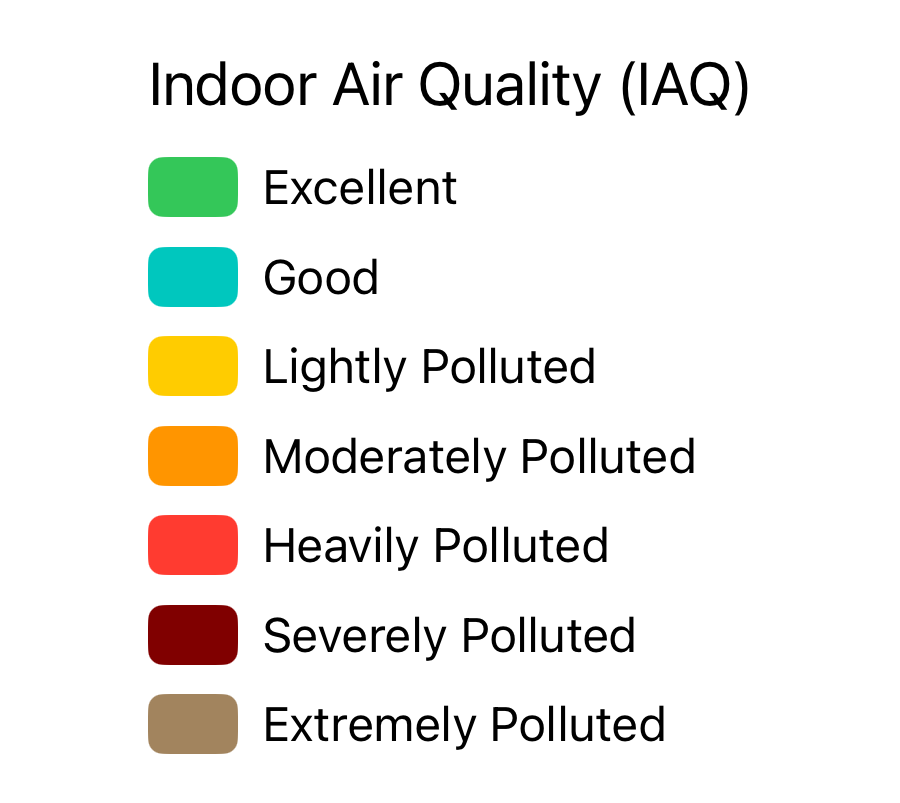
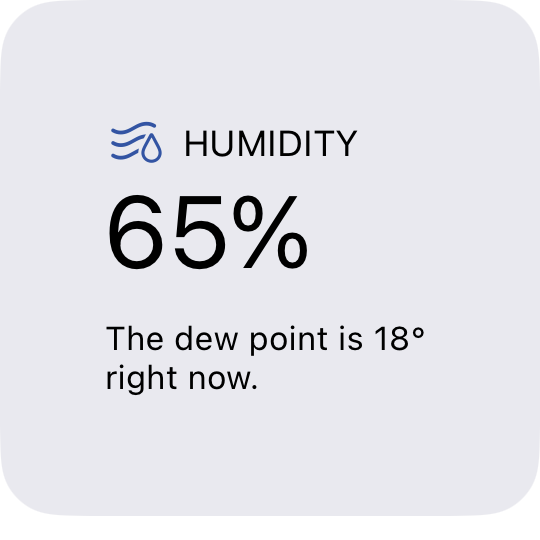
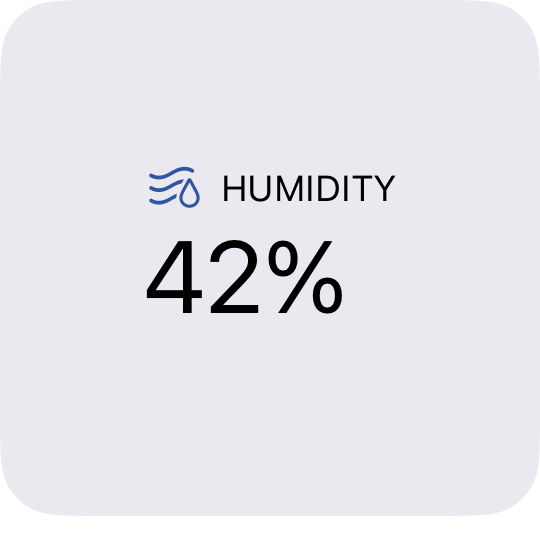
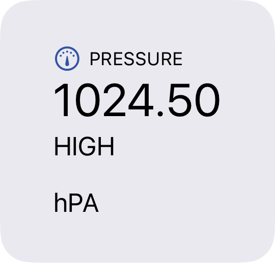
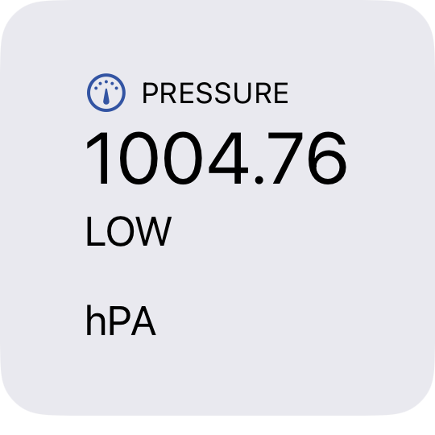

# Telemetry & Sensors

Meshtastic nodes can report sensor data across the mesh, giving you visibility into the physical environment at remote locations.

## Telemetry Types

| Type | Data |
|------|------|
| Device Metrics | Battery level, battery voltage, channel utilisation, airtime fraction |
| Environment | Temperature (°C/°F), relative humidity (%), barometric pressure (hPa) |
| Air Quality | PM1.0, PM2.5, PM10 particulate counts (µg/m³) |
| Power | Voltage and current readings from power monitoring sensors |

### Device Metrics

### Air Quality

### Environment

## Viewing Telemetry

Telemetry is visible in two places:

1. **Node Detail** — tap any node in the Nodes tab. The Logs section shows the most recent device metrics and environment readings.
2. **Telemetry Charts** — tap the chart icon in a node detail to see historical graphs for any telemetry type the node has reported.

## Configuring Telemetry

Go to **Settings → Telemetry** to enable telemetry modules and set reporting intervals:

| Setting | Description |
|---------|-------------|
| Device Metrics Interval | How often (seconds) the node broadcasts battery and utilisation data. |
| Environment Interval | How often environment sensor data is broadcast. |
| Air Quality Interval | How often air quality sensor data is broadcast. |
| Environment Screen | Show environment data on the device screen. |
| Telemetry on Admin Channel | Restrict telemetry to the admin channel instead of broadcast. |

## Supported Sensors

The app displays data from any sensor supported by Meshtastic firmware. Common sensors:

- **BME280 / BME680** — temperature, humidity, pressure
- **SHT31** — temperature, humidity
- **MCP9808** — precision temperature
- **INA219 / INA260** — power monitoring
- **PMSA003** — air quality (PM2.5)

Sensor availability depends on your hardware. Check the [Meshtastic hardware guide](https://meshtastic.org/docs/hardware/) for compatibility.

## Detection Sensor

The Detection Sensor module alerts the mesh when a connected PIR motion sensor or contact switch is triggered. Configure it in **Settings → Detection Sensor**. Alerts appear as messages on the primary channel and as node log entries.
