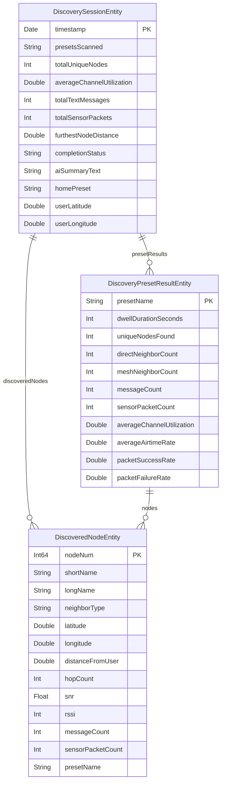

# Data Model: Local Mesh Discovery

## Entity Relationship Diagram



## Entity Definitions

### DiscoverySessionEntity

A single scan run capturing aggregate metrics across all presets.

| Field | Type | Default | Description |
|-------|------|---------|-------------|
| `timestamp` | `Date` | `Date()` | When the scan started |
| `presetsScanned` | `String` | `""` | Comma-separated preset names (e.g., `"LongFast,MedFast"`) |
| `totalUniqueNodes` | `Int` | `0` | Deduplicated node count across all presets (by nodeNum) |
| `averageChannelUtilization` | `Double` | `0.0` | Weighted average channel utilization across presets |
| `totalTextMessages` | `Int` | `0` | Sum of text messages across all presets |
| `totalSensorPackets` | `Int` | `0` | Sum of environment telemetry packets across all presets |
| `furthestNodeDistance` | `Double` | `0.0` | Maximum distance (meters) to any discovered node |
| `completionStatus` | `String` | `"inProgress"` | One of: `"complete"`, `"stopped"`, `"interrupted"`, `"inProgress"` |
| `aiSummaryText` | `String` | `""` | Foundation Model generated summary (empty if unavailable) |
| `homePreset` | `String` | `""` | Original modem preset to restore on completion/stop |
| `userLatitude` | `Double` | `0.0` | User's position at scan start |
| `userLongitude` | `Double` | `0.0` | User's position at scan start |
| `presetResults` | `[DiscoveryPresetResultEntity]` | `[]` | Relationship: per-preset breakdowns |
| `discoveredNodes` | `[DiscoveredNodeEntity]` | `[]` | Relationship: all nodes observed |

**Relationships**:
- `presetResults` → `[DiscoveryPresetResultEntity]` (cascade delete)
- `discoveredNodes` → `[DiscoveredNodeEntity]` (cascade delete)

**Identity**: Each session is unique by `timestamp`. No two sessions can start at the exact same `Date`.

**Lifecycle**: `inProgress` → `complete` | `stopped` | `interrupted`

### DiscoveryPresetResultEntity

Per-preset aggregated metrics within a session.

| Field | Type | Default | Description |
|-------|------|---------|-------------|
| `presetName` | `String` | `""` | Modem preset name (e.g., `"LongFast"`) |
| `dwellDurationSeconds` | `Int` | `0` | Configured dwell time in seconds |
| `uniqueNodesFound` | `Int` | `0` | Nodes heard on this preset |
| `directNeighborCount` | `Int` | `0` | Nodes heard at 1-hop (SNR/RSSI available) |
| `meshNeighborCount` | `Int` | `0` | Nodes discovered via NeighborInfo |
| `messageCount` | `Int` | `0` | TEXT_MESSAGE_APP packets received |
| `sensorPacketCount` | `Int` | `0` | EnvironmentMetrics packets received |
| `averageChannelUtilization` | `Double` | `0.0` | Average `ch_util` from DeviceMetrics (2-packet rule) |
| `averageAirtimeRate` | `Double` | `0.0` | Average Δ `air_util_tx` / elapsed (2-packet rule) |
| `packetSuccessRate` | `Double` | `0.0` | From LocalStats: `numPacketsRx / (numPacketsRx + numRxBad)` |
| `packetFailureRate` | `Double` | `0.0` | From LocalStats: `numRxBad / (numPacketsRx + numRxBad)` |
| `session` | `DiscoverySessionEntity?` | `nil` | Inverse relationship |

**Relationships**:
- `session` → `DiscoverySessionEntity` (inverse of `presetResults`, nullify)
- `nodes` → `[DiscoveredNodeEntity]` (inverse of `presetResult`, nullify)

### DiscoveredNodeEntity

A single node observation during a scan, scoped to a preset.

| Field | Type | Default | Description |
|-------|------|---------|-------------|
| `nodeNum` | `Int64` | `0` | Meshtastic node number (unique per physical device) |
| `shortName` | `String` | `""` | 4-char short name from NodeInfo |
| `longName` | `String` | `""` | Long name from NodeInfo |
| `neighborType` | `String` | `"direct"` | `"direct"` (1-hop, heard via SNR/RSSI) or `"mesh"` (via NeighborInfo) |
| `latitude` | `Double` | `0.0` | Node position latitude (0.0 if unknown) |
| `longitude` | `Double` | `0.0` | Node position longitude (0.0 if unknown) |
| `distanceFromUser` | `Double` | `0.0` | Computed distance in meters from user at scan time |
| `hopCount` | `Int` | `0` | Hop count from packet header |
| `snr` | `Float` | `0.0` | Signal-to-noise ratio (direct neighbors only) |
| `rssi` | `Int` | `0` | Received signal strength (direct neighbors only) |
| `messageCount` | `Int` | `0` | TEXT_MESSAGE_APP packets from this node |
| `sensorPacketCount` | `Int` | `0` | EnvironmentMetrics packets from this node |
| `presetName` | `String` | `""` | Which preset was active when this node was observed |
| `session` | `DiscoverySessionEntity?` | `nil` | Inverse relationship |
| `presetResult` | `DiscoveryPresetResultEntity?` | `nil` | Inverse relationship |

**Relationships**:
- `session` → `DiscoverySessionEntity` (inverse of `discoveredNodes`, nullify)
- `presetResult` → `DiscoveryPresetResultEntity` (inverse of `nodes`, nullify)

**Icon Classification** (computed, not stored): `messageCount >= sensorPacketCount` → `person.2.fill` (social); otherwise → `thermometer.medium` (sensor).

## Validation Rules

1. `completionStatus` MUST be one of `"complete"`, `"stopped"`, `"interrupted"`, `"inProgress"`.
2. `neighborType` MUST be one of `"direct"`, `"mesh"`.
3. `dwellDurationSeconds` MUST be between 900 (15 min) and 10800 (180 min), in increments of 900.
4. `totalUniqueNodes` is computed by deduplicating `discoveredNodes` by `nodeNum` across all presets.
5. `presetsScanned` stores preset names as comma-separated for display; the authoritative preset list is in `presetResults`.

## State Transitions

```
DiscoverySessionEntity.completionStatus:
  "inProgress" → "complete"    (all presets dwelled, analysis done)
  "inProgress" → "stopped"     (user tapped Stop Scan)
  "inProgress" → "interrupted" (app terminated / BLE timeout)
```

## Registration

Add to `MeshtasticSchema.allModels`:
```swift
DiscoverySessionEntity.self,
DiscoveryPresetResultEntity.self,
DiscoveredNodeEntity.self,
```
