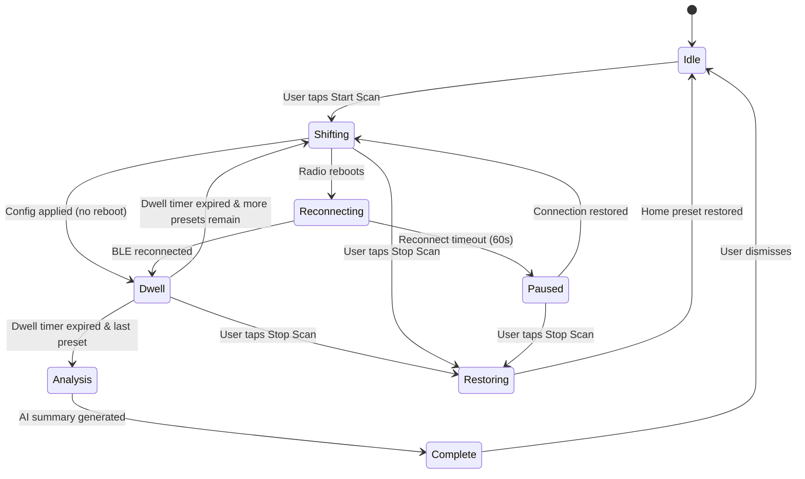
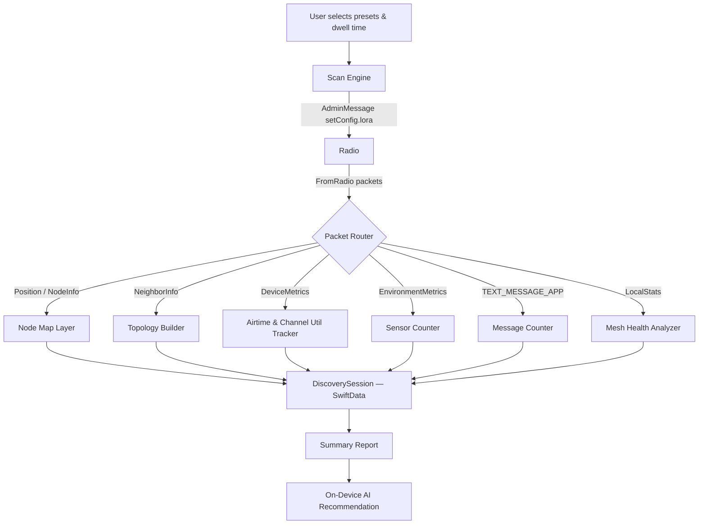

# Feature Specification: Local Mesh Discovery

**Feature Branch**: `001-local-mesh-discovery`
**Created**: 2026-04-27
**Status**: Draft
**Input**: User description: "Local Mesh Discovery — a high-fidelity diagnostic and community-mapping tool that cycles through modem presets to audit the local RF environment"

## User Scenarios & Testing *(mandatory)*

### User Story 1 — Configure and Run a Multi-Preset Scan (Priority: P1)

A Meshtastic user wants to discover what nodes and activity exist in their local area across different LoRa modem presets. They navigate to Settings > Developers > Local Mesh Discovery, select two or more presets (e.g., LongFast, MediumFast), set a dwell time per preset, and tap "Start Scan." The app cycles through each preset — sending an admin config change to the radio, waiting for the radio to reconnect if it reboots, dwelling for the configured time while collecting packets, and then advancing to the next preset. The user sees a progress indicator showing which preset is active and how much dwell time remains.

**Why this priority**: Without the core scan engine there is no feature. This is the minimum viable product — everything else builds on the data it collects.

**Independent Test**: Connect to a radio, select one preset, set the minimum dwell time (15 min), start the scan, and verify the radio changes preset and the app collects node/telemetry data during the dwell window.

**Acceptance Scenarios**:

1. **Given** the user is connected to a Meshtastic radio, **When** they select two presets with a 15-minute dwell each and tap Start Scan, **Then** the app sends an `AdminMessage` to switch to the first preset, waits for the radio to become available, begins the dwell timer, and collects incoming packets.
2. **Given** the radio reboots after a preset change, **When** the BLE connection drops, **Then** the app automatically reconnects and resumes the dwell timer for that preset.
3. **Given** a preset's dwell window completes, **When** the timer expires, **Then** the app advances to the next preset in the queue and repeats the process.
4. **Given** all presets have completed, **When** the scan finishes, **Then** the app transitions to the Analysis state and stores the session.
5. **Given** a scan is in progress, **When** the user taps "Stop Scan," **Then** the scan halts gracefully, partial results are saved, and the user's original ("home") preset is restored.

---

### User Story 2 — Visualize Discovered Nodes on a Map (Priority: P2)

After or during a scan the user views a map that shows all discovered nodes, color-coded by how they were heard. Direct neighbors (1-hop) appear in green; mesh neighbors discovered via NeighborInfo appear in blue. Lines connect the user's position to direct neighbors. A rotating radar-sweep animation indicates when a scan is actively collecting data.

**Why this priority**: The map is the primary way users understand their RF environment. Without it the raw data has limited value. It depends on P1 data collection.

**Independent Test**: Run a single-preset scan for 15 minutes in a location with known nodes. After the dwell period, verify each heard node appears on the map with the correct color and that topology lines are drawn to direct neighbors.

**Acceptance Scenarios**:

1. **Given** a scan has collected position data from at least one node, **When** the user views the Discovery Map, **Then** the node appears as a marker at the correct coordinates.
2. **Given** a node was heard directly (1-hop, via SNR/RSSI), **When** the map renders, **Then** the marker is green and a polyline connects it to the user's position.
3. **Given** a node was discovered via a NeighborInfo packet (multi-hop), **When** the map renders, **Then** the marker is blue and no direct polyline is drawn to the user.
4. **Given** a node has sent multiple text messages during the scan, **When** the map renders, **Then** its marker uses a "social activity" icon (`person.2.fill`).
5. **Given** a node has sent environment telemetry during the scan, **When** the map renders, **Then** its marker uses a "sensor" icon (`thermometer.medium`).
6. **Given** a scan is actively dwelling, **When** the map is visible, **Then** a translucent radar-sweep animation rotates over the map.

---

### User Story 3 — Review Scan Summary and AI Recommendation (Priority: P3)

After a scan completes the user sees a summary report that compares each preset's findings: unique node count, chat vs. sensor ratio, channel utilization, and packet success rate. An on-device AI model produces a plain-language recommendation of which preset is best suited for this location and use case.

**Why this priority**: The AI summary turns raw data into actionable insight. It is valuable but depends on both data collection (P1) and the user having run a meaningful scan.

**Independent Test**: Complete a two-preset scan in an area with known traffic. Verify the summary displays correct per-preset metrics and the AI recommendation references the preset with the best node-count-to-channel-utilization ratio.

**Acceptance Scenarios**:

1. **Given** a scan has completed across two or more presets, **When** the user views the report, **Then** per-preset cards show unique node count, message count, sensor packet count, average channel utilization, and furthest node distance.
2. **Given** a scan has collected `LocalStats` from at least one remote node, **When** the report renders, **Then** the RF Health section displays packet success and failure rates.
3. **Given** sufficient scan data exists, **When** the on-device AI processes it, **Then** a natural-language summary identifies which preset found the most nodes, which is dominated by chat vs. telemetry, and which has the best reliability.
4. **Given** the AI has generated a recommendation, **When** the user reads it, **Then** the recommendation includes an actionable suggestion (e.g., "Switch to LongFast for this location — it discovered the most unique nodes with acceptable channel utilization").

---

### User Story 4 — Persist and Review Past Sessions (Priority: P4)

A user who ran a scan last week wants to revisit the results. They open a Session History list, see all past discovery sessions sorted by date, and tap one to view its saved map and summary. They can also delete old sessions.

**Why this priority**: Persistence enables longitudinal comparison and is low risk to implement once the data model exists.

**Independent Test**: Complete a scan, force-quit the app, relaunch, navigate to Session History, and verify the saved session appears with correct metadata.

**Acceptance Scenarios**:

1. **Given** a completed scan, **When** the app saves the session, **Then** a `DiscoverySession` record is persisted with timestamp, presets scanned, node count, average channel utilization, message count, sensor packet count, and furthest distance.
2. **Given** saved sessions exist, **When** the user opens Session History, **Then** sessions are listed in reverse chronological order with a summary line.
3. **Given** the user taps a past session, **When** the detail view loads, **Then** the saved map and summary report are displayed.
4. **Given** the user swipes to delete a session, **When** they confirm, **Then** the session and its associated data are removed.

---

### User Story 5 — 2.4 GHz Preset Gating (Priority: P5)

A user whose hardware does not support the SX1280/SX1281 2.4 GHz radio should not see the LORA_24 preset in the selection list. A user whose hardware does support it should see it and be able to include it in a scan.

**Why this priority**: Prevents user confusion and failed config attempts. Small scope but important for correctness.

**Independent Test**: Connect to a non-2.4 GHz radio and verify LORA_24 is absent from the preset picker. Connect to a 2.4 GHz-capable radio and verify it appears.

**Acceptance Scenarios**:

1. **Given** a connected radio whose hardware model has a "2.4GHz" tag in DeviceHardware, **When** the preset picker renders, **Then** the LORA_24 option is available.
2. **Given** a connected radio without 2.4 GHz support, **When** the preset picker renders, **Then** the LORA_24 option is hidden.

---

### Edge Cases

- **Radio disconnects mid-dwell (not reboot)**: If the BLE connection is lost and does not recover within 60 seconds, the scan pauses and alerts the user. Partial data for the current preset is retained.
- **User leaves the Discovery screen mid-scan**: The scan continues in the background. Returning to the screen resumes the UI (map, timer) from current state.
- **No nodes discovered on a preset**: The preset card in the summary shows "0 nodes found" and the AI factors this into its recommendation.
- **NeighborInfo references an unknown node**: A mesh-neighbor marker is placed at an unknown location (omitted from the map) but counted in the summary statistics.
- **User starts a scan while already on the target preset**: The engine skips the admin config change for that preset and begins dwelling immediately.
- **App is terminated by the OS during a scan**: On next launch, any in-progress session is marked as incomplete and partial results are preserved.

## State Machine

## Data Flow

## Requirements *(mandatory)*

### Functional Requirements

- **FR-001**: The system MUST present a multi-select list of modem presets (LongFast, LongSlow, LongModerate, LongTurbo, MedSlow, MedFast, ShortSlow, ShortFast, ShortTurbo) for the user to include in a scan.
- **FR-002**: The LORA_24 preset MUST only appear in the preset list when the connected hardware has a "2.4GHz" tag in the device hardware database.
- **FR-003**: The system MUST allow the user to configure a dwell time per preset in 15-minute increments with a minimum of 15 minutes and a maximum of 180 minutes (3 hours, aligned with the NodeInfo broadcast interval).
- **FR-004**: The system MUST send an `AdminMessage` with `setConfig.lora` to change the radio's modem preset when transitioning between scan presets.
- **FR-005**: The system MUST detect whether a config change causes a radio reboot and, if so, automatically reconnect via BLE and resume the dwell timer.
- **FR-006**: During each dwell window the system MUST ingest and associate the following packet types with the active scan preset: Position, NodeInfo, NeighborInfo, DeviceMetrics, EnvironmentMetrics, text messages (`TEXT_MESSAGE_APP`), and LocalStats.
- **FR-007**: The system MUST distinguish "Direct Neighbors" (nodes heard at 1-hop via SNR/RSSI) from "Mesh Neighbors" (nodes reported in NeighborInfo packets from other nodes).
- **FR-008**: The system MUST apply the "2-Packet Rule" for DeviceMetrics — requiring at least 2 DeviceMetrics packets from a node to compute Airtime Rate ($\Delta$ `air_util_tx` / elapsed time) and record Channel Utilization (`ch_util`).
- **FR-009**: The system MUST display a Discovery Map using MapKit showing node markers color-coded by neighbor type (green for direct, blue for mesh) with topology polylines to direct neighbors.
- **FR-010**: The system MUST display a rotating radar-sweep animation on the map while a scan is actively dwelling.
- **FR-011**: The system MUST classify each discovered node's map icon by comparing its text-message count to its environment-telemetry count during the scan. If text messages ≥ environment packets, use `person.2.fill` (social). If environment packets > text messages, use `thermometer.medium` (sensor). Ties default to social.
- **FR-012**: Upon scan completion the system MUST generate a per-preset summary including: unique node count, message count, sensor packet count, average channel utilization, packet success/failure rates (from LocalStats), and furthest node distance.
- **FR-013**: Upon scan completion the system MUST invoke an on-device foundation model to produce a natural-language summary and preset recommendation based on the collected metrics from the current scan and all available historical session data (e.g., trend comparisons, recurring node patterns).
- **FR-014**: The system MUST persist each completed or stopped scan as a `DiscoverySession` in SwiftData with all associated metrics.
- **FR-015**: The system MUST allow the user to stop a scan at any time, save partial results, and restore the radio's original ("home") modem preset.
- **FR-016**: The system MUST provide a Session History view listing all past discovery sessions with the ability to view details or delete sessions.
- **FR-017**: Discovery sessions MUST be retained indefinitely in SwiftData. The only removal mechanism is explicit user deletion via the Session History view.

### Key Entities

- **DiscoverySession**: A single scan run. Attributes: timestamp, presets scanned (list), total unique nodes found (deduplicated by node number across all presets), average channel utilization, total text messages counted, total sensor packets counted, furthest node distance, completion status (complete / stopped / interrupted), AI summary text, home preset (original preset to restore).
- **DiscoveryPresetResult**: Per-preset data within a session. Attributes: preset name, dwell duration, unique nodes found, direct neighbor count, mesh neighbor count, message count, sensor packet count, average channel utilization, average airtime rate, packet success rate, packet failure rate.
- **DiscoveredNode**: A node observed during a session. Attributes: node number, short name, long name, neighbor type (direct / mesh), latitude, longitude, distance from user, hop count, SNR, RSSI, message count, sensor packet count, preset on which discovered.

## Success Criteria *(mandatory)*

### Measurable Outcomes

- **SC-001**: A user can configure and complete a two-preset scan in under 35 minutes (including 15-minute dwells).
- **SC-002**: The scan discovers at least one node not visible on the user's default preset when run in an area with known multi-preset activity.
- **SC-003**: The AI recommendation correctly identifies the preset with the best unique-node-count-to-channel-utilization ratio in 80% or more of scans with meaningful data (≥3 nodes across ≥2 presets).
- **SC-004**: The radar animation provides continuous visual feedback with no dropped frames or UI freezes during an active dwell.
- **SC-005**: 90% of users who start a scan successfully complete it without manual intervention (excluding intentional stops).
- **SC-006**: Past sessions load from SwiftData and display their map and summary within 2 seconds.

## Clarifications

### Session 2026-04-27

- Q: What threshold distinguishes a "social" node from a "sensor" node for map icon selection? → A: Ratio-based — whichever packet type the node sent more of wins; ties default to social (`person.2.fill`).
- Q: What is the maximum dwell time per preset? → A: 180 minutes (3 hours), aligned with the NodeInfo broadcast interval.
- Q: How are nodes counted across presets? → A: Session-level unique node count deduplicates by node number; per-preset counts are independent (a node on preset A and preset B counts once per preset, since it can only operate on one preset at a time).
- Q: Where is Local Mesh Discovery accessed in the app navigation? → A: Under the Developers section in Settings (alongside App Files and Tools). Deep link: `meshtastic:///settings/localMeshDiscovery`.
- Q: Should old sessions be auto-purged or kept indefinitely? → A: Kept indefinitely; user deletes manually. AI summaries should leverage all available historical session data for richer recommendations.

## Assumptions

- The user has a Meshtastic radio connected via BLE with firmware that supports `AdminMessage` for LoRa config changes.
- The connected radio is the user's own device (they have admin rights to change its config). The feature does not attempt to change config on remote nodes.
- NeighborInfo packets are broadcast by at least some nodes in the mesh. If no NeighborInfo is received, the "Mesh Neighbors" layer will be empty and the summary will reflect this.
- The on-device AI model (Apple Foundation Model) is available on the user's hardware. If the model is unavailable (e.g., older devices), the summary section falls back to a structured table without natural-language narrative.
- Position data for the user's own node is available via GPS or manual pin. If no position is available, topology polylines and distance calculations are omitted.
- The existing `saveLoRaConfig` method in `AccessoryManager+ToRadio.swift` is used to send preset changes. No new protobuf message types are required.
- NeighborInfo packet processing (currently logged but unhandled at port 71) will need to be implemented as part of this feature.
- The "2-Packet Rule" for airtime rate requires that the dwell window is long enough (≥15 min) for most nodes to send at least two DeviceMetrics packets at their default telemetry interval.
